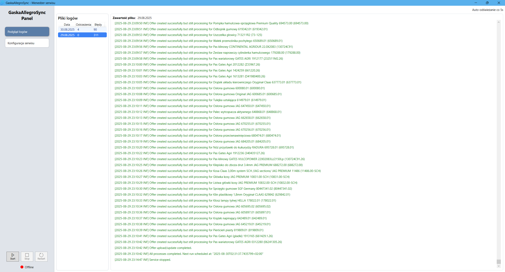
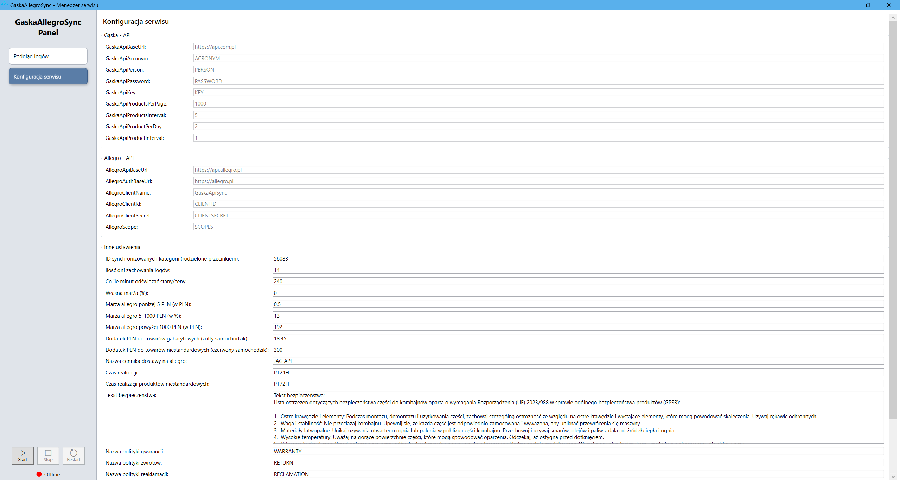

# AduosSyncServices

> Commercial project - part of a private or client-facing initiative.

## Overview

**AduosSyncServices** is a collection of Windows worker services and a WPF configurator that automate product and order synchronization between Aduos data sources (Gaska/Rolmar) and marketplace platforms (Allegro, Erli). Each service runs independently, focuses on a single integration flow, and ships with structured logging.

## Solution Layout

### Worker Services (`net10.0`)

- `Allegro.Aduos.Gaska.ProductsService` - synchronizes Gaska products into JSAGRO Allegro account.
### Shared Libraries

- `AduosSyncServices.Contracts` - shared contracts (DTOs, models, settings, interfaces, enums).
- `AduosSyncServices.Infrastructure` - shared infrastructure (logging, data access, SQL Server migrations).

### Desktop Tooling (`net8.0-windows`)

- `ServiceManager` - WPF configurator and service monitor for runtime settings and log viewing.

## Features

- Product catalog and offer synchronization
- Order import workflows
- Image processing and uploads
- SQL Server-backed state and migrations
- Serilog-based structured logging

## Screenshots

### Configurator - Log View

### Configurator - Settings

## Technologies Used

- **Frameworks:** .NET 10 Worker Service, .NET 8 WPF
- **Language:** C#
- **Data Sources & Targets:** REST APIs (Gaska, Allegro, Erli)
- **Database:** SQL Server
- **Data Access:** Dapper
- **Logging:** Serilog

## License

This project is licensed under the [MIT License](LICENSE).

---

© 2026-present [calKU0](https://github.com/calKU0)
