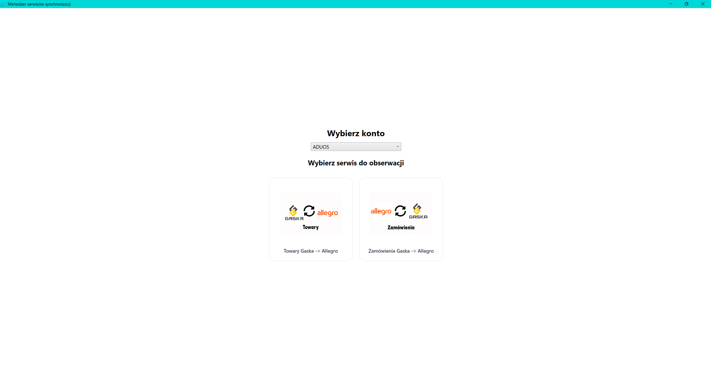
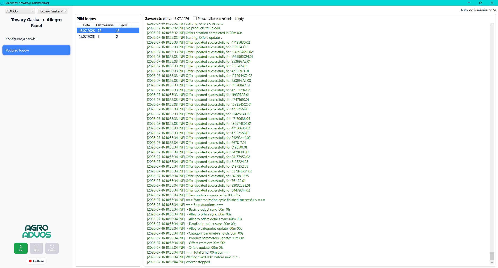
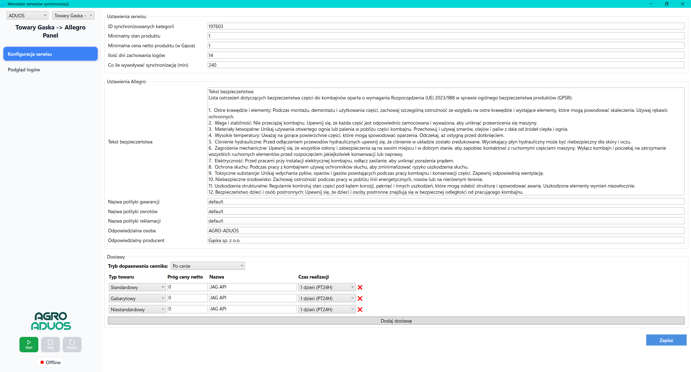
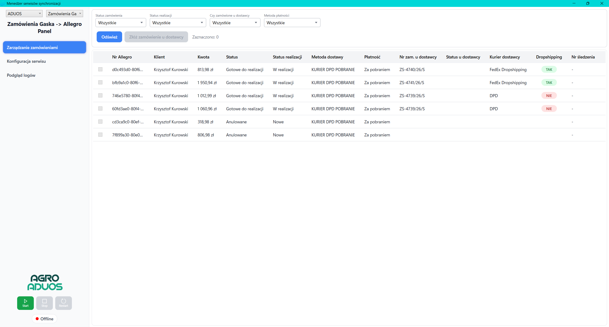
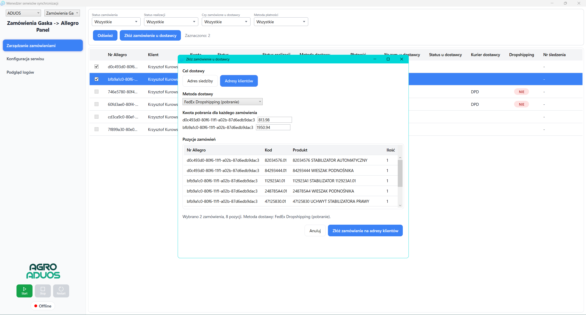

# AduosSyncServices

> Commercial project - part of a private or client-facing initiative.

## Overview

**AduosSyncServices** is a collection of Windows worker services and a WPF configurator that automate product and order synchronization between Aduos data sources (Gaska/Rolmar) and marketplace platforms (Allegro, Erli). Each service runs independently, focuses on a single integration flow, and ships with structured logging.

## Solution Layout

### Worker Services (`net10.0`)

- `Allegro.Aduos.Gaska.ProductsService` - synchronizes Gaska products into JSAGRO Allegro account.
- `Allegro.Aduos.Gaska.OrdersService` - syncs Allegro orders and their Gąska fulfillment status; its sync logic is shared with (and also driven from) the Orders panel in `AduosSyncServices.ServicesManager`.

### Shared Libraries

- `AduosSyncServices.Contracts` - shared contracts (DTOs, models, settings, interfaces, enums).
- `AduosSyncServices.Infrastructure` - shared infrastructure (logging, data access, SQL Server migrations, Allegro/Gąska API clients, order sync and placement services).

### Desktop Tooling (`net10.0-windows`)

- `AduosSyncServices.ServicesManager` - WPF configurator and service monitor: start/stop/restart services, edit runtime settings, tail logs, and (for services with order management enabled) browse and place supplier orders through the **Orders panel** described below.

## Features

- Product catalog and offer synchronization
- Order import workflows
- **Orders management panel** (in `AduosSyncServices.ServicesManager`) for Allegro orders synced from Gąska:
  - Filterable, auto-refreshing (every 5 minutes, plus on panel entry, manual refresh, and after placing an order) grid of all orders, backed by a live Allegro sync rather than just the local database
  - Bulk order placement with the Gąska supplier, either combined to the company's headquarters address or split per customer for dropshipping, including cash-on-delivery amounts
  - Live per-product stock verification against Gąska before placing an order, with a rate-limited check loop to respect the supplier API's limits
  - Safeguards against double-placing an order (checkbox and server-side guard) and against placing orders for products/orders not yet ready for processing
  - Immediate post-placement verification: re-fetches the newly created Gąska order to confirm it exists and to pull back its real order number, status, and tracking info
- Product archiving: products missing from a Gąska sync are archived (not deleted) and their Allegro offers ended, with the local record only removed once safely unreferenced
- Image processing and uploads
- SQL Server-backed state and migrations
- Serilog-based structured logging

## Screenshots

### Service monitor - Start View

### Service monitor - Log View

### Service monitor - Settings

### Service monitor - Orders List

### Service monitor - Create Order

## Technologies Used

- **Frameworks:** .NET 10 Worker Service, .NET 10 WPF
- **Language:** C#
- **Data Sources & Targets:** REST APIs (Gaska, Allegro, Erli)
- **Database:** SQL Server
- **Data Access:** Dapper
- **Logging:** Serilog

## License

This project is licensed under the [MIT License](LICENSE).

---

© 2026-present [calKU0](https://github.com/calKU0)
